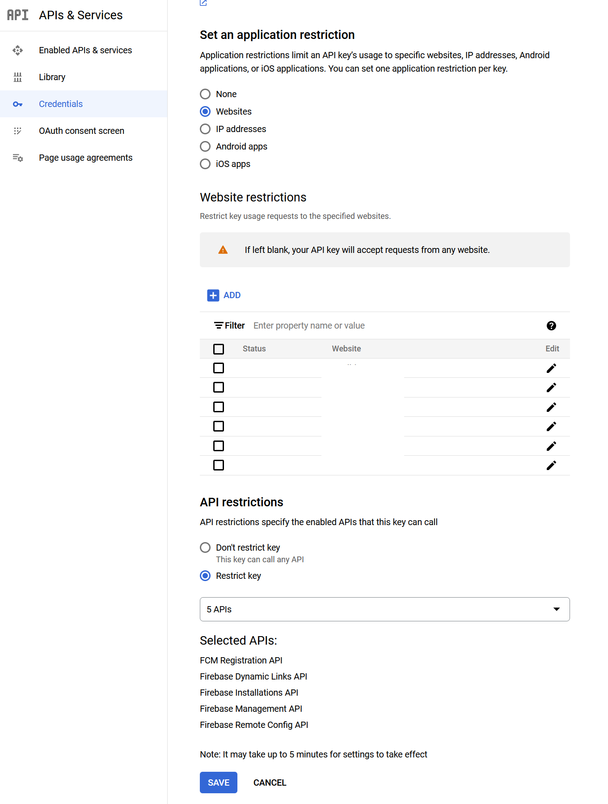

## Firebase Installation Error (403 PERMISSION_DENIED)
```
FirebaseError: Installations: Create Installation request failed with error "403 PERMISSION_DENIED: Requests from referer http://localhost:9000/ are blocked." (installations/request-failed).
```

Go to the https://console.cloud.google.com/apis and Select these APIs:

* Firebase Management API
* Firebase Installations API 

Both need to set valid URLs in the Credentials section.

